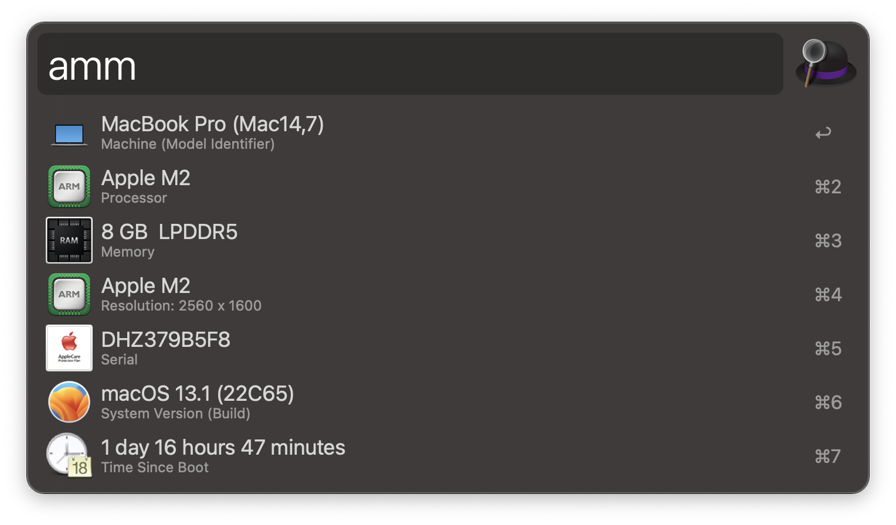

# About This Mac

A workflow for [Alfred][1].

## Usage

**About This Mac** workflow can be used by the `amm` keyword.

## Credits

This workflow is based on the [About This Mac workflow by Roger W][2] and relies on `getMacIcon.applescript` by [ChristoferK][3] to generate user's machine icon.

## License

**About This Mac** workflow code is released under the [MIT License][4].

[1]:http://www.alfredapp.com/
[2]:https://www.alfredforum.com/topic/2025-about-this-mac/
[3]:https://github.com/ChristoferK
[4]:https://opensource.org/licenses/MIT
