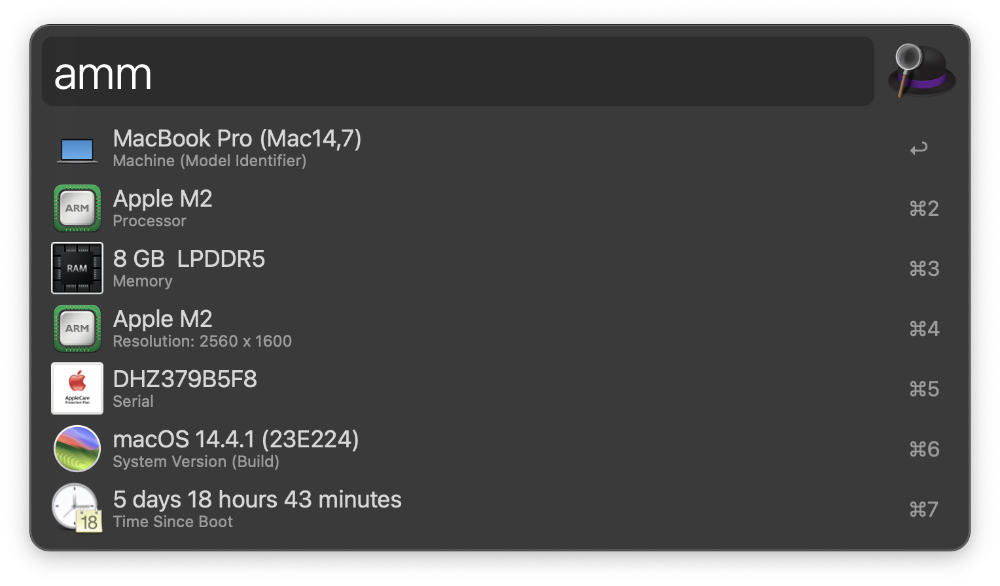

# About This Mac

A workflow for [Alfred 4][1].

## Download and Installation

Download the workflow file from [GitHub releases][2] and install it by double-clicking on `About.This.Mac.alfredworklow`.

## Usage

**About This Mac** workflow can be used by the `amm` keyword.

## Credits

This workflow is based on the [About This Mac workflow by Roger W][3].

## License

**About This Mac** workflow code is released under the [MIT License][4].

[1]:http://www.alfredapp.com/
[2]:https://github.com/xilopaint/alfred-about-this-mac/releases/latest
[3]:https://www.alfredforum.com/topic/2025-about-this-mac/
[4]:https://opensource.org/licenses/MIT
